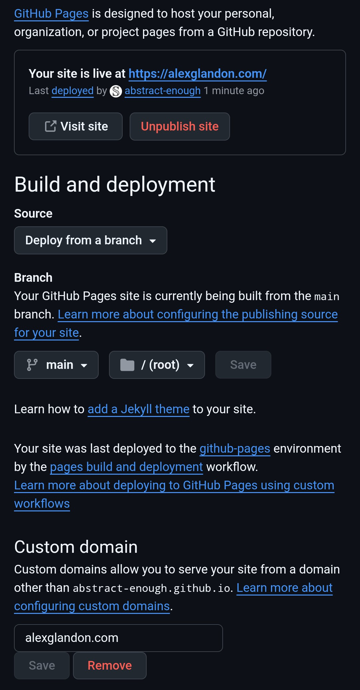
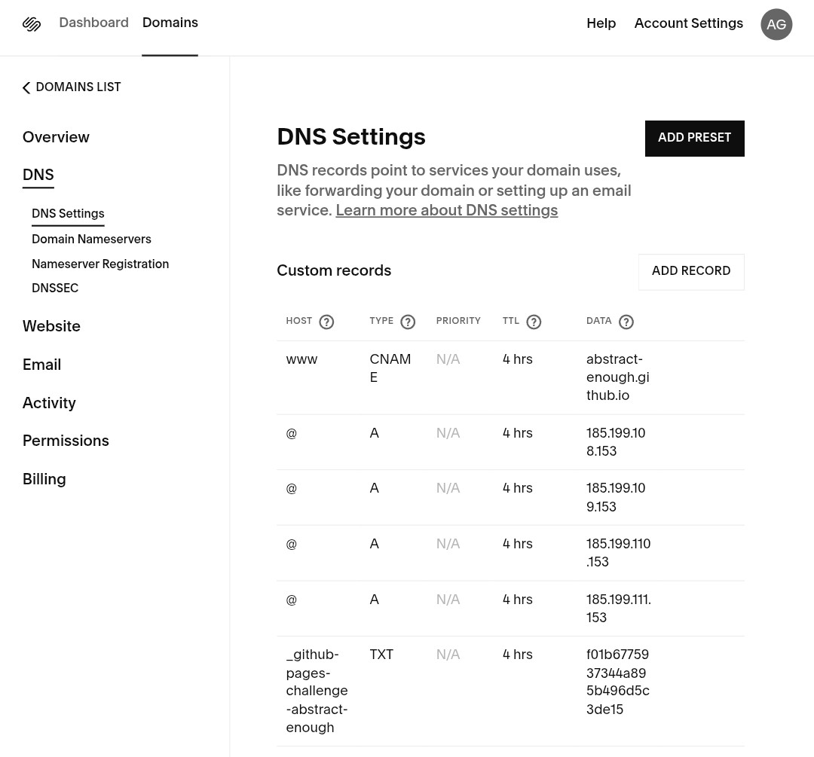

# [alexglandon.com](https://alexglandon.com)

Clean single page website demo.

GitHub repo Settings/Pages

DNS settings for host

[reference](https://docs.github.com/en/pages/configuring-a-custom-domain-for-your-github-pages-site/managing-a-custom-domain-for-your-github-pages-site)
